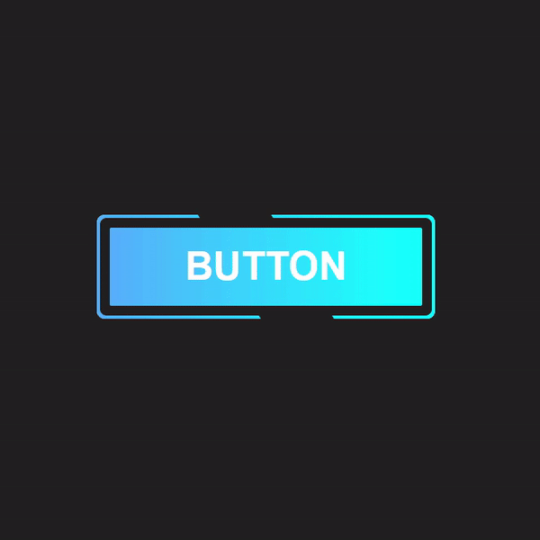

# Boton-Bordes-Animados
botón con efecto  de bordes animado, hecho en HTML, CSS y JS

  
    
  
    
  
  

## ¿Cuál es el fin de este proyecto?
Este proyecto se creó con fines de aprendizaje usando HTML, CSS y JavaScript. 

## ¿Puedo Probarlo en Linea? 
Si, Puedes probarlo en linea haciendo click [aqui](https://carlosorellana00.github.io/Boton-Bordes-Animados/)

## Referencias y Agradecimientos a: 
- [Autor Original -> Tuat Tran Anh](https://www.youtube.com/c/TuatTranAnh)
- [Video Original -> CSS Animate Button Border | CSS Animation](https://www.youtube.com/watch?v=_rTgCXkeVKk&t=13s)
- [Código Fuente Original](https://github.com/trananhtuat/css-animate-button-border)
